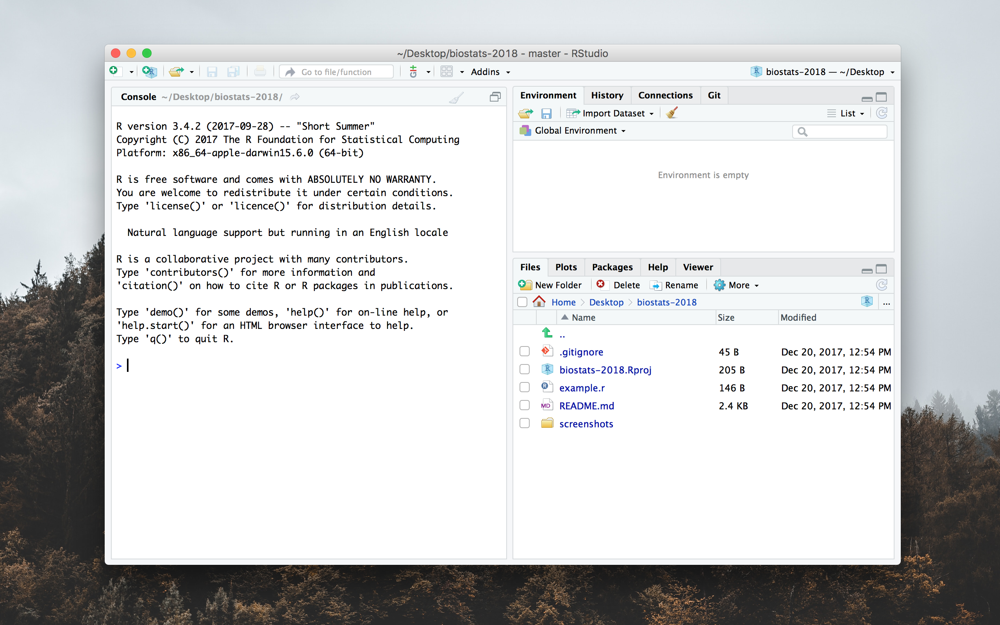
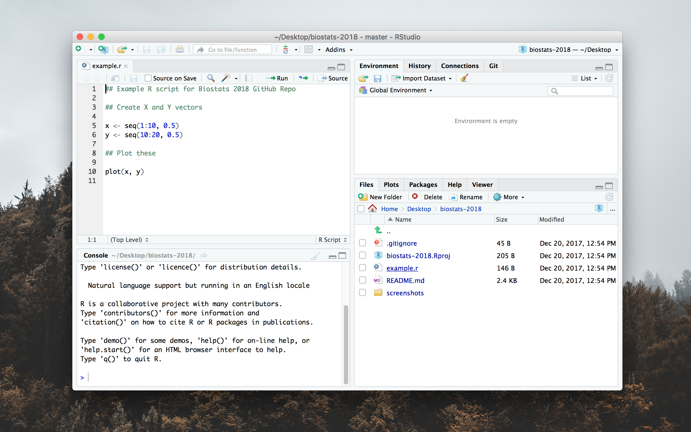
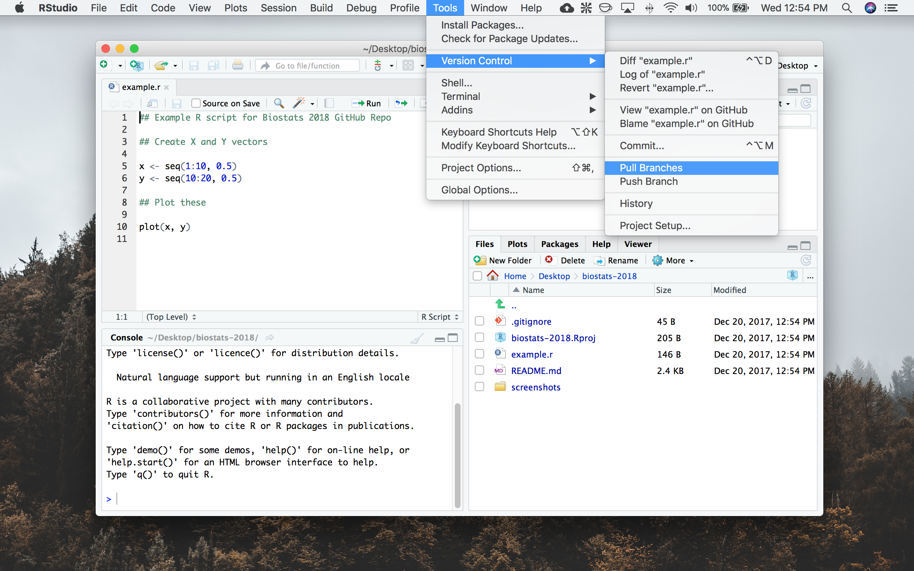

# Biostatistics R

(short URL: [bit.ly/biostats18](http://bit.ly/biostats18))

This is the GitHub repository (repo) for Spg 2018 Biol 437/558


Instructor: Weixing Zhu S3-391

TA: Matthew Lundquist S3-359

If you are new to GitHub, you should check out this [blog post by Lauren
Orsini](http://readwrite.com/2013/09/30/understanding-github-a-journey-for-beginners-part-1).
However, for this class you only need to know how to download content from the
repo.

For in-class activities, we  are going to use
the built-in capabilities of RStudio to interface directly with this
GitHub repository using the git version control software.


## Install Git

Whether you are using MacOS, Windows, or Linux, you will need to
download Git.

MacOS:

Download [Git for MacOS](https://git-scm.com/download/mac) and just
follow the prompts.

Windows:

Download [Git for Windows](https://git-scm.com/download/win) and
follow the prompts. The default settings should work fine.

Ubuntu: 

Open Terminal and type:

```
sudo apt-get update
sudo apt-get install git
```

Thats it, now you have Git!


## Install R and RStudio


These are the instructions for MacOS, but they should be similar to
what you need to do in Windows or Linux

1.  Download latest version of <code>R</code> from
    [cran.r-project.org](https://cran.r-project.org)
2.  Download the latest version of <code>RStudio</code> from 
    [www.RStudio.org](https://www.rstudio.com/products/rstudio/download/)
3.  Open RStudio.app 
    
4.  Navigate to <code> File > New Project...</code> 
    
5.  Choose <code>Version Control</code>
    
6.  Choose <code>Git</code>
    
7.  Set <code>Repository URL:
    https://github.com/mlundquist/biostats-2018 </code>
    and set the <code>Project directory name:
    biostats-2018</code> and set <code>~/Desktop</code>(or whatever directory you want to
    use) then select <code>Create Project</code>
   
8.  At this point RStudio should download everything from this GitHub
    repository into your project directory (bottom right).
    
9. You can now navigate folders and open files directly in
    RStudio. For example: <code>Open example.r</code> and it will open
    in the built-in text editor (top left)
    
10. Frequently, content will be added and updated in the
    repository. To download the new content, you simply need to
    <code>Pull</code> the code from the repository. Do this by
    navigating to <code>Tools > Version Control > Pull Branches</code> 
    

When in doubt, you can also get the files off of GitHub by downloading them
manually. To do this:

1. Click on the folder that contains the file you are interested in.
2. Click on the file you are interested in downloading.
3. On the top right corner you will see a button that reads <code>Raw</code>.
4. Right click on <code>Raw</code> and select "Save Linked File"
5. Depending on your browser, it will either download automatically or you can choose where to download it on to your machine.
6. You should now be able to read and edit the file.

# Useful links:

[TA Blog](http://www.lundquistecology.com/blog.html)

[Biologist's Analytic Toolkit](http://biotoolbox.binghamton.edu)

[MyCourses](https://mycourses.binghamton.edu)
