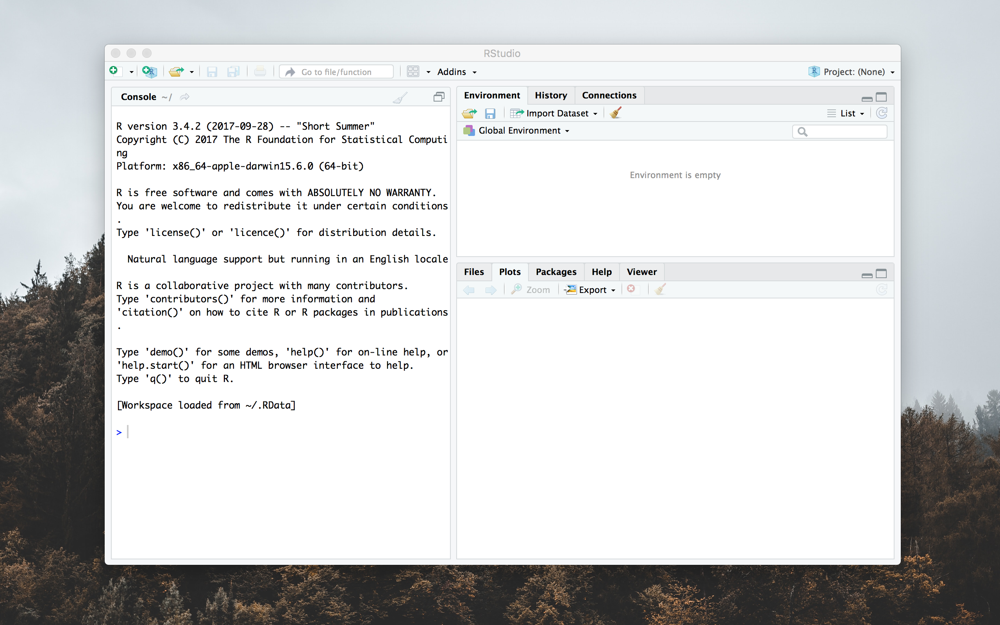
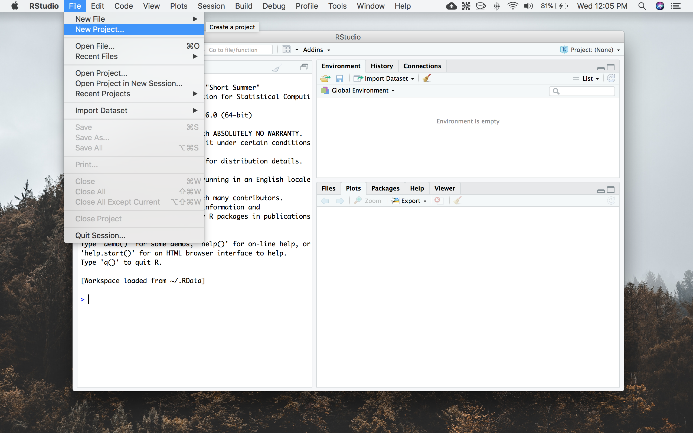
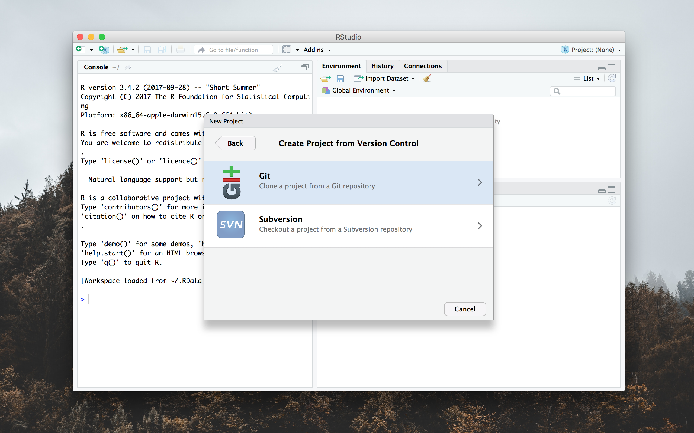
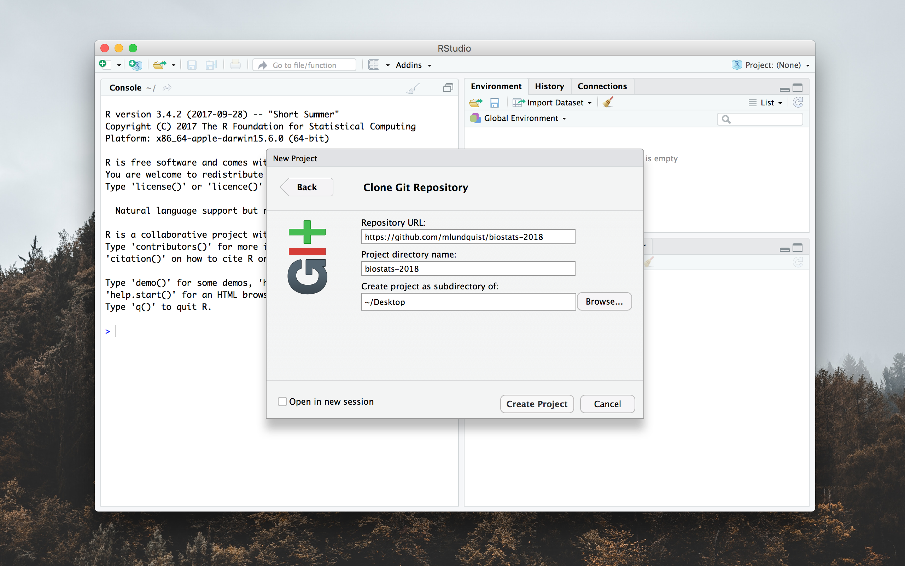

# Biostatistics R

(short URL: [bit.ly/biostats18](http://bit.ly/biostats18))

This is the GitHub repository (repo) for Spg 2018 Biol 437/558

Instructor: Weixing Zhu S3-391

TA: Matthew Lundquist S3-359

If you are new to GitHub, you should check out this [blog post by Lauren
Orsini](http://readwrite.com/2013/09/30/understanding-github-a-journey-for-beginners-part-1).
However, for this class you only need to know how to download content from the
repo.

For in-class activities, we  are going to use
the built-in capabilities of RStudio to interface directly with this
GitHub repository using the git version control software.

Instructions:

## MacOS

1. Download latest version of <code>R</code> from
   [cran.r-project.org](https://cran.r-project.org/bin/macosx/R-3.4.3.pkg)
2. Download the latest version of <code>RStudio</code> from 
   [www.RStudio.org](https://download1.rstudio.org/RStudio-1.1.383.dmg)
3. Create a folder for your R code, for example "~/Desktop/biostats-2018"
4. Open RStudio.app 
   
5. Navigate to <code> File > New Project...</code> 
   
6. Choose <code>Version Control</code>
   
7. Choose <code>Git</code>
   
8. Set <code>Repository URL:
   https://github.com/mlundquist/biostats-2018 </code>
   and set the <code>Project directory name:
   ~/Desktop/biostats-2018</code> (or whatever directory you want to
   use) then select <code>Create Project</code>
   
9. At this point RStudio should download everything from this GitHub
   repository into your project directory.

## Windows

## Ubuntu

When in doubt, you can also get the files off of GitHub by downloading them
manually. To do this:

1. Click on the folder that contains the file you are interested in.
2. Click on the file you are interested in downloading.
3. On the top right corner you will see a button that reads <code>Raw</code>.
4. Right click on <code>Raw</code> and select "Save Linked File"
5. Depending on your browser, it will either download automatically or you can choose where to download it on to your machine.
6. You should now be able to read and edit the file.

# Useful links:

[TA Blog](http://www.lundquistecology.com/blog.html)

[Biologist's Analytic Toolkit](http://biotoolbox.binghamton.edu)

[MyCourses](https://mycourses.binghamton.edu)
