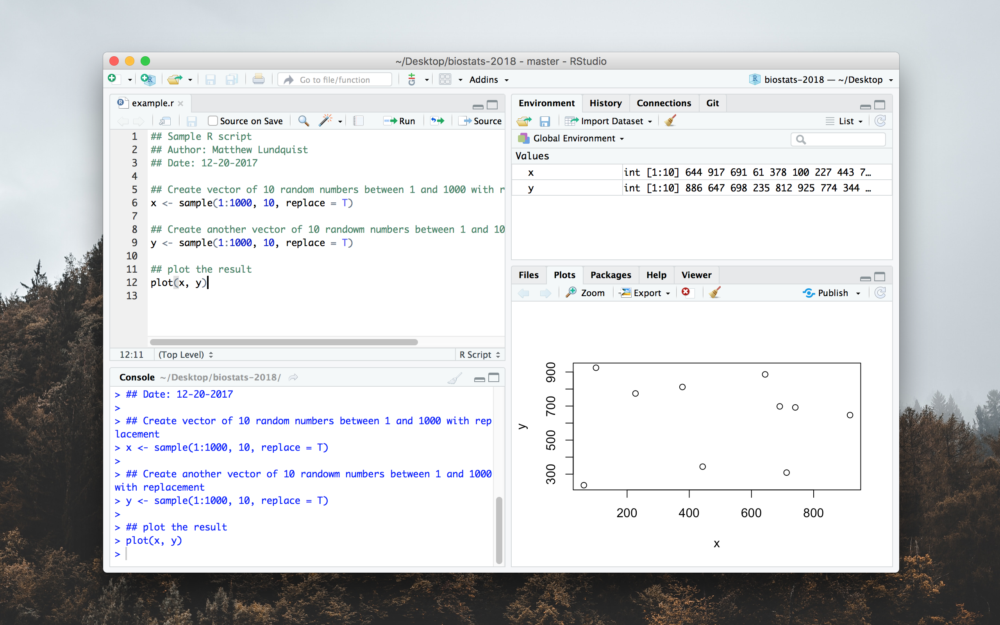
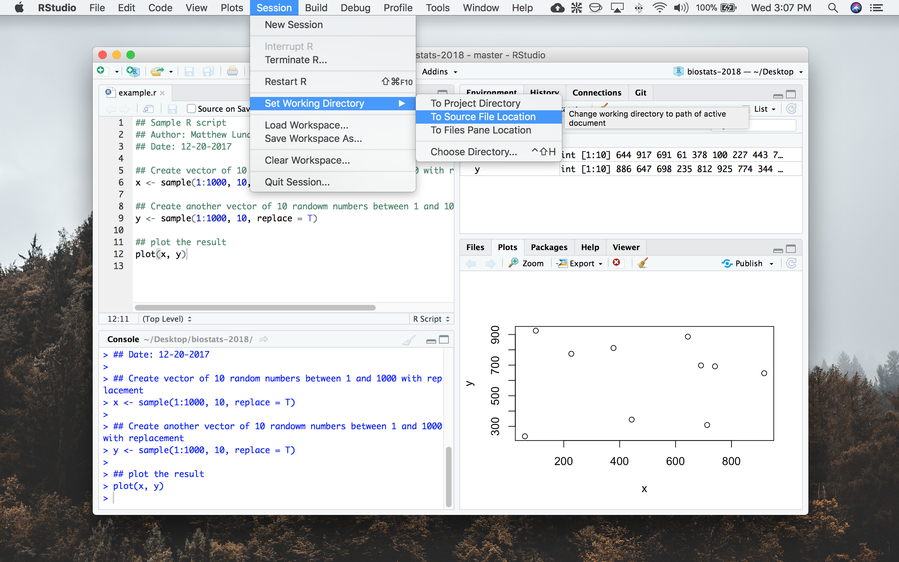

# Introduction to R and RStudio

Please read the main
[README](https://github.com/mlundquist/biostats-2018) for where to
download R and RStudio and how to use the version control (git)
feature in RStudio.

## What is R?

R is a statical software environment for the analysis of data and the
production of graphics (R-project.org). Using R can be daunting for
the uninitiated because it is entirely command-line based. However, 
this is the greatest strength that R has because 
it is extremely flexible, customizable, and (for most things) fast. R
is also free and open-source, meaning that there are a lot of 
people out there that maintain the project and write 
specific statistical packages. There are plenty of other programs
(SAS, SPSS, MATLAB, Excel) out there that you can use to do data 
analysis but they are expensive and less customizable. 
There are other software environments out there too (Python, Julia)
for those who need a little more speed and flexibility. R brings to the table some very
powerful analysis and graphics production tools in a package that is pretty
easy to use (once you get the hang of it). It is an attractive program for
students and professionals alike and is continuing to grow in interest and
complexity. Skills in data analysis with R is now becoming a must for many looking 
for graduate or professional positions and is a great addition to a
resumé.

## Writing your first R file

R is a program that lives almost exclusively in the command line. This
is great for streamlining your work flow: you type in what you want R
to do, press <code>ENTER</code> and off you go.

**But** once you press <code>ENTER</code>, that code is basically gone
and you better home you didn't have any typos!

The **BETTER** way of working with R is writing a plain text document 
that has all of the R commands you will need and saving it with a ".R" 
extension. Any command that you want to pass to R should be written
down  in an .R file. You can save R commands in any format you want 
(.docx, .txt) but if you want to be able to use it directly in R or 
RStudio, you need to use the .R extension.

You can use any text editor you want. Some examples are Notepad 
(built into Windows), TextEdit (built into OSX), Notepad++, Atom,
Sublime Text, Emacs or Vim. The last four also have plugins designed 
to work directly in R from that particular program. I have used all 
of these and really can't suggest one over the other. (If you are
curious, I currently using Emacs).

You can also use the built-in text editor in RStudio. It is located by 
default in the top left quarter of the program window. In that box you 
can write your code and use a keyboard shortcut, <code>Ctl + Enter</code> in
Windows, <code>Cmd + Enter</code> in MacOS to evaluate that code right
in an R console session.

R scripts generally have two parts: <code>code you want to run</code>, 
and annotations to code using comments, <code>#</code>.

Here is an example script:

```
## Sample R script
## Author: Matthew Lundquist
## Date: 12-20-2017

## Create vector of 10 random numbers between 1 and 1000 with replacement        
  x <- sample(1:1000, 10, replace = T)

## Create another vector of 10 randowm numbers between 1 and 1000 with replacement
  y <- sample(1:1000, 10, replace = T)

## plot the result
  plot(x, y)
```

If you run this script in RStudio, you will end up with two vectors,
one named ```x``` and one named ```y``` in your ```Environment``` 
(top right) and a figure in your ```plot``` section (bottom right). 



Plots can be saved using the ```Export``` drop down menu in RStudio.


## Inputting data 

The next step is to actually use R to input and analyze your data. 
First we need data. In this case the data below, ```iris.txt```, is saved 
as a text file. You can also save data as .csv (Comma Separated Value) 
files. Data can be edited directly in those files using a text editor
but it is easier just to use a spreadsheet application like Microsoft 
Excel, Sheets, or Libre Office Calc and then saving them as a .csv.

If you already ```Pulled``` this branch, you should already have ```iris.txt```.

To input this data you first need to set your ```Working
directory```. If you open ```example.r``` in RStudio, you
simply need to navigate to ```Session > Set Working Directory > To Source File Location```.



Then you can run the following commands

```
## Inputting data in R from .txt file
  
## Read in iris.txt and name it iris (make sure first row is
## recognized as column names
  iris <- read.table("iris.txt", h = T)
     
## Call the data to make sure it is inputted correctly
  iris
```

Notice that there are **150 rows** of data and **five columns**. 
Each row represents an individual iris flower. The first four columns 
indicate what was measured from that flower. The last column
identifies the species of the flower. 

The first four columns are what we would call **numerical data**, 
we can perform mathematical operations on them. The last column is 
what we would call a **factor** or a **identifier** or a **grouping
variable** for your data. In this case, the column "Species" 
indicates from what species of iris the data was collected. 
There are a total of three species (three factors) in this data set.

## Basic Analysis

Now that we have the data, we can start to analyze it. Here are a few
functions to calculate means, median, SE, and SD.

```
## Mean Sepal.Length
  sepal.mean <- mean(iris$Sepal.Length)
  sepal.mean

## Standard Deviation Sepal.Length
  sepal.sd <- sd(iris$Sepal.Length)
  sepal.sd
   
## Standard Error Sepal.Lenth
  sepal.se <- sepal.sd/sqrt(length(iris$Sepal.Length))
  sepal.se

## Median Petal.Width
  petal.median <- median(iris$Petal.Width)
  petal.median

## Mean Petal.Length for just setosa
  setosa.petal <- mean(iris$Petal.Length[iris$Species == "setosa"])
  setosa.petal

## Summary statistics for all observations and factors
  summary(iris)

```
